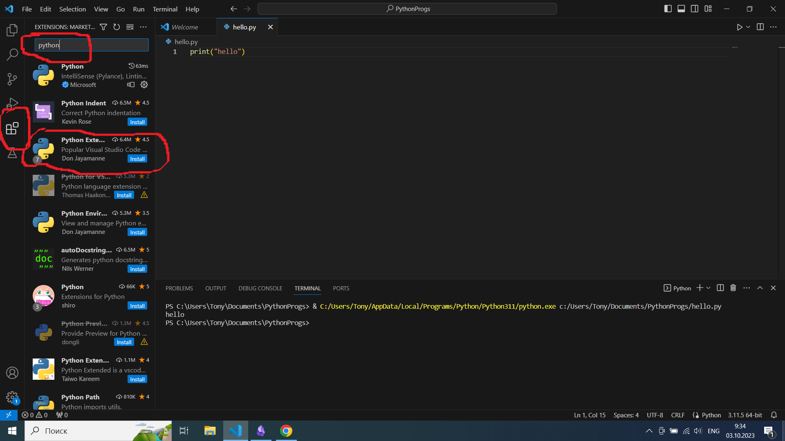
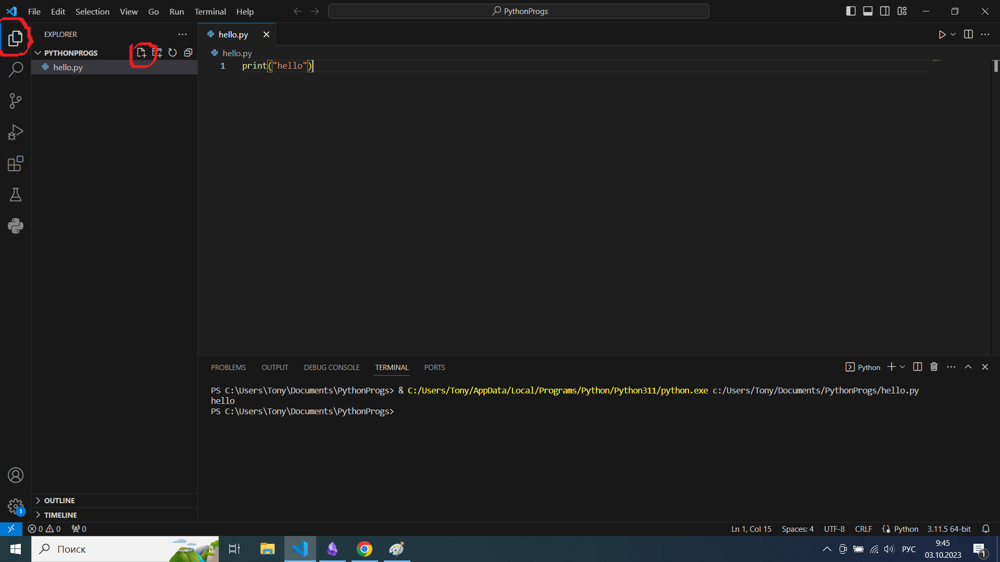

## Установка
На этом уроке мы познакомимся с тем, как установить и настроить необходимые для работы с Python программы. Нам потребуется интерпретатор языка Python версии 3.8.10.

### Python на Windows
Необходимую версию интерпретатора для компьютера с операционной системой Windows вы можете найти по [ссылке](https://www.python.org/downloads/release/python-3810/). На странице выберите **Windows installer** в зависимости от разрядности вашей системы (32-bit или 64-bit). После загрузки установите интерпретатор, и **обязательно поставьте галочку "Add Python to PATH"** на первом экране установщика, чтобы Python автоматически обнаруживался при запуске команд в командной строке.

### Python на Linux Ubuntu
Для установки нужной версии Python необходимо добавить репозиторий со всеми версиями Python:

```bash
sudo add-apt-repository ppa:deadsnakes/ppa
sudo apt update
```

Затем установите необходимую версию Python:

```bash
sudo apt install python3.8 python3.8-venv python3.8-dev
```

### Visual Studio Code
Также нам понадобится среда разработки — Visual Studio Code (VS Code). Это продвинутый текстовый редактор, который подсвечивает синтаксис языка программирования, следит за форматированием, позволяет запускать и отлаживать программы в одном окне с текстом, а также обладает множеством других полезных возможностей. В этом курсе предлагается работать в бесплатной среде Visual Studio Code. Скачать ее можно [здесь](https://code.visualstudio.com/Download/).

#### Установка на Windows
Для установки на Windows скачайте **System Installer** и установите программу, следуя инструкциям установщика (нажимая "Next").

#### Установка на Ubuntu
Для установки на Ubuntu можно воспользоваться AppCenter. Если по каким-то причинам это не ваш путь, то скачайте .deb файл с сайта Visual Studio Code и установите его командами:

```bash
sudo apt install ./<file>.deb
```

Если у вас старая версия Ubuntu, можно использовать следующие команды:

```bash
sudo dpkg -i <file>.deb
sudo apt-get install -f  # Установить зависимости
```

После установки вам потребуется скачать дополнительные расширения для работы с Python. Для этого откройте вкладку **Extensions** в VS Code (значок на боковой панели).  


В строке поиска наберите `Python` и скачайте коллекцию расширений **Python Extension Pack**. Также необходимо установить расширение для работы с markdown-файлами. Для этого найдите в поиске расширений `Markdown All In One` и установите его. 

### Проверка установки
После установки можно проверить работоспособность наших инструментов. Для этого в VS Code выберите **File -> Open Folder** и откройте папку, в которой будут храниться ваши программы. После выбора папки перейдите на вкладку **Explorer** и нажмите кнопку создания нового файла.  


Назовите новый файл `hello.py` и напишите в окне кода следующий текст:

```python
print("hello")
```

Выберите внизу, в строке состояния, пункт «Выбор интерпретатора», а затем один из установленных интерпретаторов вашей системы.

После этого запустите интерпретацию файла нажатием на стрелочку в верхнем правом углу окна VS Code. Если все установлено правильно, в окне терминала внизу появится текст `hello`, который вывела на экран ваша программа.

### Установка Git
Для удобной работы с курсом лучше всего воспользоваться системой контроля версий Git.

#### Установка на Windows
Скачайте Git по [ссылке](https://git-scm.com/download/win). Установите его, следуя инструкциям установщика (нажимая "Next" с дефолтными настройками).

#### Установка на Linux
Для установки на Linux выполните команду:

```bash
sudo apt install git
```

### Копирование файлов курса
Для того чтобы начать работать с курсом, необходимо склонировать репозиторий с файлами курса. Для этого откройте терминал или командную строку, с помощью команды `cd` перейдите в директорию, где будет храниться курс, и выполните команду:

```bash
git clone https://github.com/DeminAnton/PythonCourseStandalone.git
```

### Настройка окружения и пакетов для работы с курсом
Откройте в VS Code как рабочий каталог папку `PythonCourseStandalone`. Далее создайте новый терминал, выбрав в меню **Terminal -> New Terminal**.

#### Создание и активация виртуального окружения

Далее создайте виртуальное окружение и укажите в качестве интерпретатора Python 3.8:

Для Windows:

```bash
python -m venv venv
venv\Scripts\activate
```

Для Linux:

```bash
python3.8 -m venv venv
source venv/bin/activate
```

#### Установка зависимостей

После создания и активации окружения установите зависимости из файла `requirements.txt`:

```bash
pip install -r requirements.txt
```

### Проверка готовности
Теперь ваша среда готова к работе. Вы можете приступать к выполнению упражнений курса.